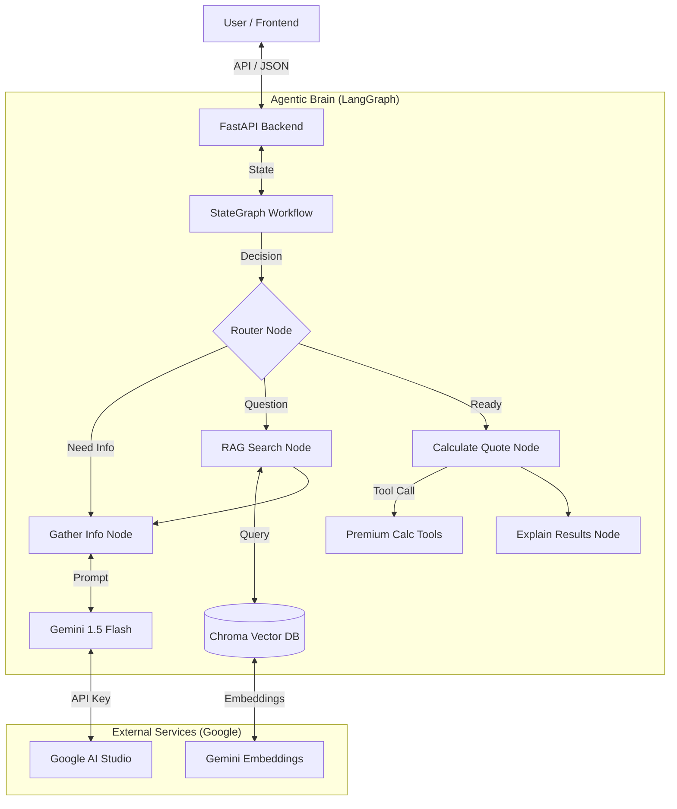

# 🏗️ Agentic AI System Architecture

## 1. Architecture Diagram

### System Components

### Decision Flow (The "Agentic" Part)
The agent autonomously decides its next step based on conversation state:
1. **Gather Info**: If missing key details (age, vehicle, etc.), it asks questions.
2. **Search Knowledge**: If the user asks "What is collision coverage?", it triggers RAG.
3. **Calculate**: Once all info is gathered, it autonomously calls the calculation tool.

---

## 2. Where is the Code?

| Component | File Path | Description |
|-----------|-----------|-------------|
| **Orchestration** | [`backend/langgraph_agent.py`](file:///C:/Users/Naveen%20Nalajala/.gemini/antigravity/scratch/insurance_agent/backend/langgraph_agent.py) | Defines the graph, nodes, edges, and decision logic. |
| **API / Integration** | [`backend/main.py`](file:///C:/Users/Naveen%20Nalajala/.gemini/antigravity/scratch/insurance_agent/backend/main.py) | FastAPI app connecting frontend to the agent graph. |
| **Knowledge Base** | [`backend/rag_system.py`](file:///C:/Users/Naveen%20Nalajala/.gemini/antigravity/scratch/insurance_agent/backend/rag_system.py) | Handles vector storage (Chroma) and retrieval. |
| **Document Vision** | [`backend/document_analyzer.py`](file:///C:/Users/Naveen%20Nalajala/.gemini/antigravity/scratch/insurance_agent/backend/document_analyzer.py) | Uses Gemini Vision to analyze uploaded policies. |
| **Frontend UI** | [`frontend/src/components/ChatInterface.jsx`](file:///C:/Users/Naveen%20Nalajala/.gemini/antigravity/scratch/insurance_agent/frontend/src/components/ChatInterface.jsx) | React chat interface with upload capability. |

---

## 3. Technologies Used

### Core AI & Orchestration
*   **LangGraph**: For building the stateful, cyclic graph workflow (the "brain").
*   **LangChain**: For tool abstraction and prompt management.
*   **Google Gemini 1.5 Flash**: The LLM providing reasoning and natural language generation (FREE tier).

### Knowledge & Data
*   **Chroma DB**: Local vector database for storing insurance knowledge (RAG).
*   **Gemini Embeddings**: Converts text into vectors for semantic search.

### Backend & API
*   **FastAPI**: High-performance Python web framework.
*   **Pydantic**: Data validation and settings management.
*   **Uvicorn**: ASGI server.

### Frontend
*   **React + Vite**: Modern, fast frontend framework.
*   **Tailwind CSS**: Utility-first styling for a premium look.
*   **Lucide React**: Beautiful icons.

---

## 4. Key Agentic Features

1.  **Multi-Step Reasoning**: Unlike a simple chatbot, this agent plans its steps (Gather -> Search -> Calculate).
2.  **Tool Use**: It "knows" when to use the calculator tool vs. when to just chat.
3.  **Memory**: It remembers context across the entire conversation session.
4.  **Multimodal**: It can "see" and analyze uploaded documents using Gemini Vision.
