# 🎨 Visual Workflow Creation Activity
**Part 3 of Workshop: Design Agent Logic Visually**

---

## 🎯 What You'll Create

A **visual flowchart** showing how your insurance agent thinks and makes decisions.

**Time**: 20 minutes  
**Tool**: Mermaid Live Editor (https://mermaid.live/)  
**No coding required!**

---

## 📊 The Visual Workflow You're Building

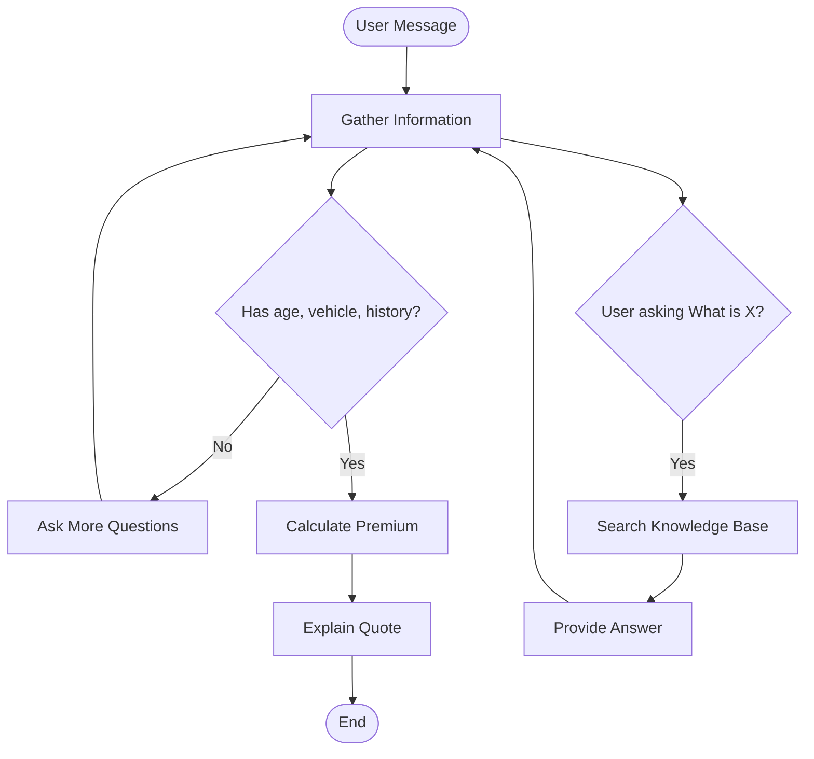

**This shows**:
- 🟢 **Green ovals** = Start/End points
- 🔵 **Blue rectangles** = Actions the agent takes
- 🔶 **Orange diamonds** = Decisions the agent makes
- ➡️ **Arrows** = Flow from one step to another

---

## 🚀 Step-by-Step: Create Your Visual Workflow

### **Step 1: Open Mermaid Live Editor** (1 min)

1. Go to: **https://mermaid.live/**
2. You'll see:
   - **Left side**: Code editor
   - **Right side**: Visual preview
3. Clear the default code

---

### **Step 2: Start with the Template** (2 min)

**Copy this template into the left side**:

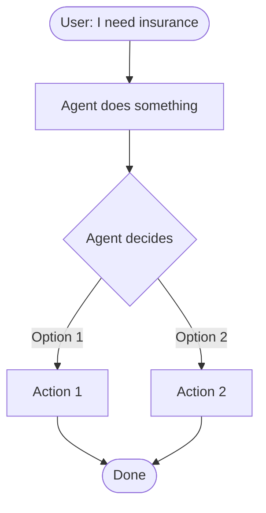

**You should see a flowchart appear on the right!**

---

### **Step 3: Design the Insurance Agent Flow** (10 min)

**Replace the template with the insurance agent logic**:

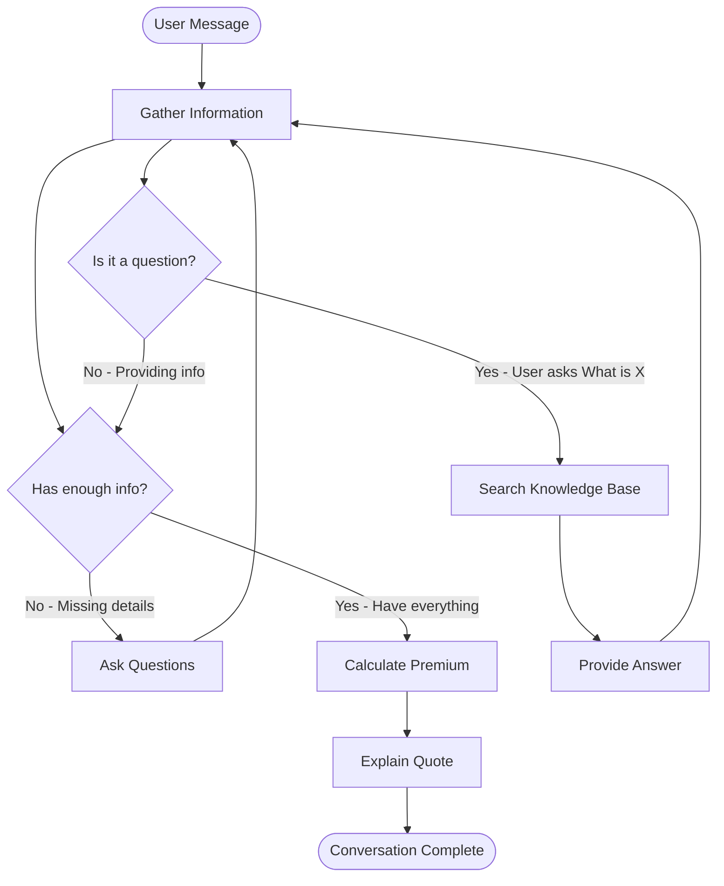

**What this shows**:

1. **Agent gathers information** from user
2. **Decision 1**: Does agent have enough info?
   - **No** → Ask more questions (loop back)
   - **Yes** → Calculate quote
3. **Decision 2**: Is user asking a question?
   - **Yes** → Search knowledge base
   - **No** → Continue gathering

---

### **Step 4: Customize Your Design** (5 min)

**Add your own logic!** Examples:

**Add insurance type detection**:
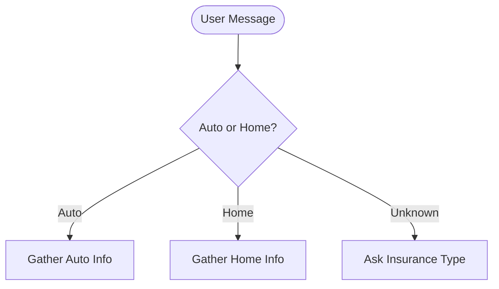

**Add error handling**:
```mermaid
    Calculate --> CheckValid{Valid data?}
    CheckValid -->|Yes| Explain[Show Quote]
    CheckValid -->|No| Error[Show Error Message]
    Error --> AskMore
```

**Add human review** (HITL):
```mermaid
    Calculate --> CheckConfidence{Confidence > 95%?}
    CheckConfidence -->|Yes| AutoApprove[Auto-approve]
    CheckConfidence -->|No| HumanReview[Send to Human]
```

---

### **Step 5: Export Your Design** (2 min)

1. **Click** the download icon (top right)
2. **Choose** "PNG" or "SVG"
3. **Save** the image
4. **Share** with implementers!

---

## 🎨 Visual Design Patterns

### **Pattern 1: Simple Linear Flow**

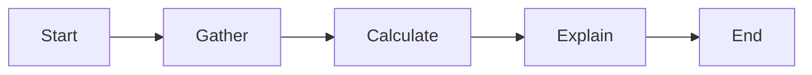

**Use for**: Simple, straightforward processes

---

### **Pattern 2: Decision Tree**

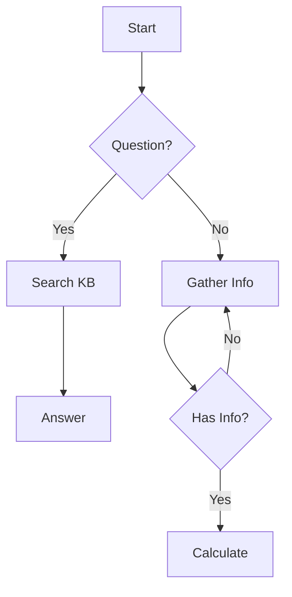

**Use for**: Agents that make decisions

---

### **Pattern 3: Loop Back**

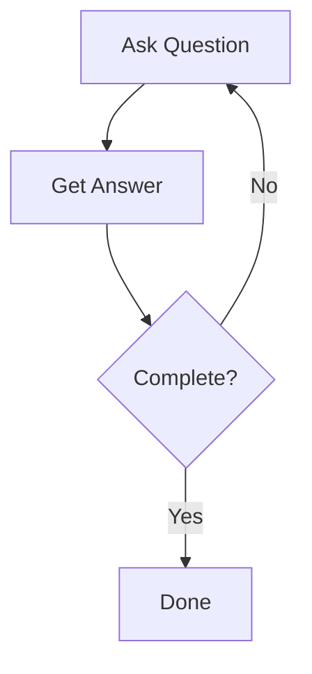

**Use for**: Iterative information gathering

---

## 🧪 Test Your Visual Design

### **Walk Through Scenarios**

**Scenario 1: Happy Path**
```
User: "I'm 28, drive a 2020 Honda Civic, licensed 10 years, no accidents"

Follow the arrows:
Start → Gather → HasInfo? → Yes → Calculate → Explain → Done ✅
```

**Scenario 2: Missing Info**
```
User: "I need car insurance"

Follow the arrows:
Start → Gather → HasInfo? → No → AskMore → Gather (loop) ✅
```

**Scenario 3: Knowledge Question**
```
User: "What is collision coverage?"

Follow the arrows:
Start → Gather → IsQuestion? → Yes → SearchKB → Answer → Gather ✅
```

**Does your design handle all scenarios?** If not, add more nodes/decisions!

---

## 💡 Tips for Great Visual Designs

### **1. Keep It Simple**
- Start with 3-5 nodes
- Add complexity later
- Each node = one clear action

### **2. Use Clear Labels**
```
❌ Bad: "Process"
✅ Good: "Calculate Premium"

❌ Bad: "Check"
✅ Good: "Has age, vehicle, history?"
```

### **3. Show Loops**
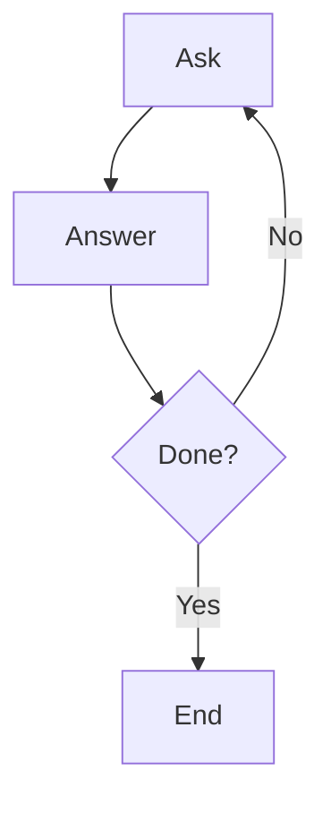

### **4. Use Colors** (optional)
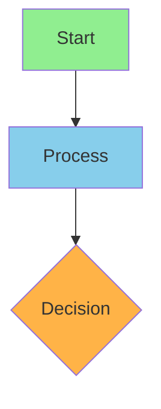

---

## 🔄 From Visual to Code

### **Your Visual Design**:
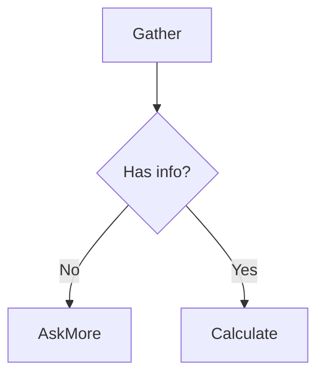

### **Becomes Code** (Implementers do this):
```python
# Nodes
workflow.add_node("gather", gather_node)
workflow.add_node("calculate", calculate_node)

# Decision
def has_enough_info(state):
    if state["user_info"]["age"] and state["user_info"]["vehicle"]:
        return "calculate"
    else:
        return "gather"

# Edges
workflow.add_conditional_edges(
    "gather",
    has_enough_info,
    {
        "calculate": "calculate",
        "gather": "gather"  # Loop back
    }
)
```

**You designed it visually, they coded it!**

---

## 📋 Workshop Activity Checklist

**Orchestrators**:
- [ ] Open Mermaid Live Editor
- [ ] Copy insurance agent template
- [ ] Customize for your use case
- [ ] Test with 3 scenarios
- [ ] Export as PNG
- [ ] Share with implementers
- [ ] Explain your logic

**Implementers**:
- [ ] Receive visual design
- [ ] Understand the flow
- [ ] Code nodes and edges
- [ ] Test with orchestrator's scenarios
- [ ] Show orchestrators it works!

---

## 🎯 Example: Complete Insurance Agent Workflow

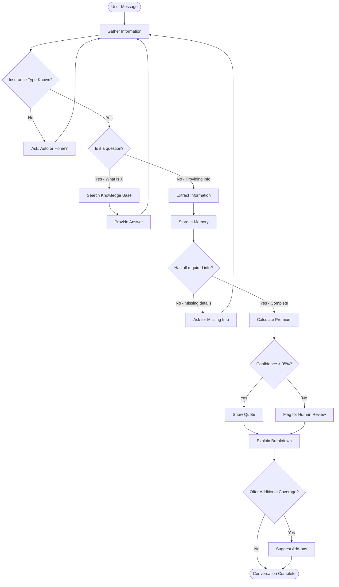

**This shows**:
- ✅ Information gathering loop
- ✅ Knowledge base search
- ✅ Decision making
- ✅ Human-in-the-loop
- ✅ Upselling logic
- ✅ Complete conversation flow

---

## 📚 Resources

**Tools**:
- **Mermaid Live**: https://mermaid.live/
- **Mermaid Docs**: https://mermaid.js.org/syntax/flowchart.html
- **Draw.io**: https://app.diagrams.net/ (alternative)

**Workshop Materials**:
- **Visual LangGraph Guide**: `docs/VISUAL_LANGGRAPH_GUIDE.md`
- **Workshop Guide**: `docs/WORKSHOP_90MIN_GUIDE.md`

---

## ✅ Success Criteria

**Your visual design should**:
- ✅ Show all major actions (gather, calculate, search)
- ✅ Include decision points (has info? is question?)
- ✅ Have clear flow with arrows
- ✅ Handle loops (ask more → gather)
- ✅ Be understandable by implementers

**Implementers should be able to**:
- ✅ Look at your design
- ✅ Understand the logic
- ✅ Code it in 10 minutes
- ✅ Run it successfully

---

## 🎉 You're a Visual Designer!

**Remember**:
- Visual design is just as important as code
- Your flowcharts guide the implementation
- Good design = better agent
- Collaborate with implementers
- Iterate and improve!

---

**Next**: Implementers will turn your visual design into working LangGraph code! 🚀
