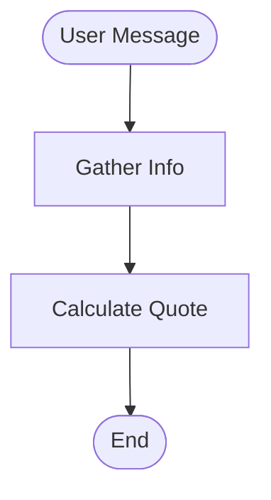
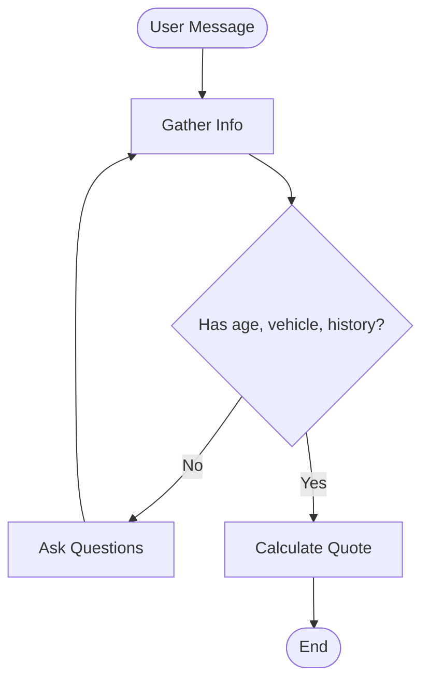
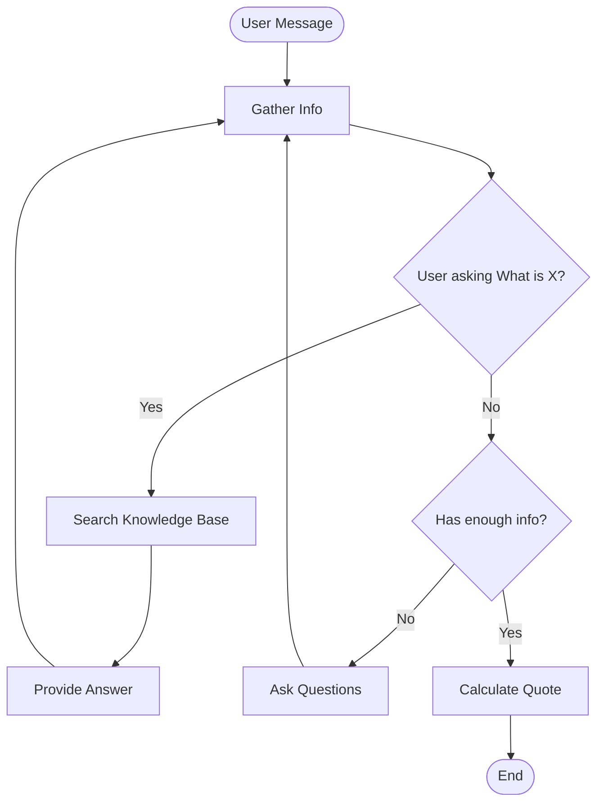
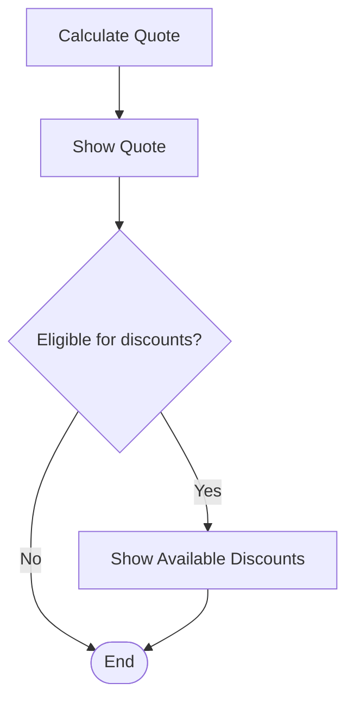
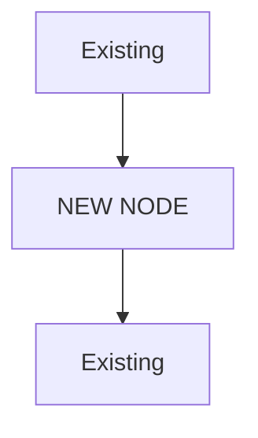
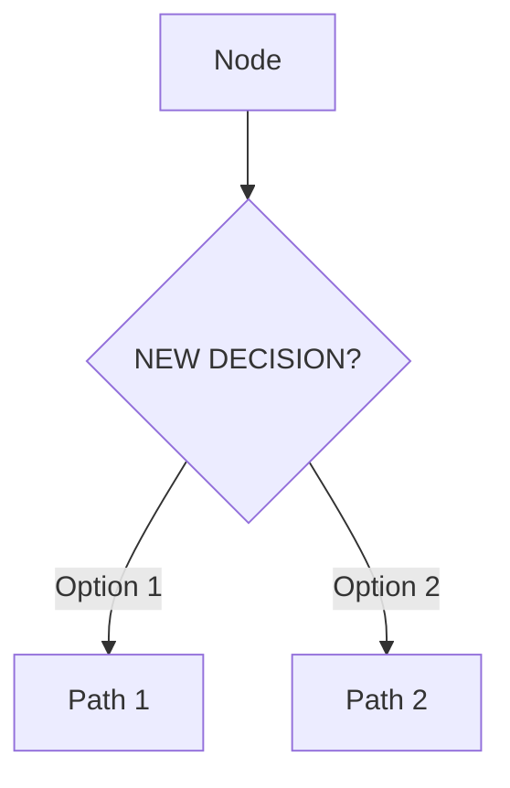
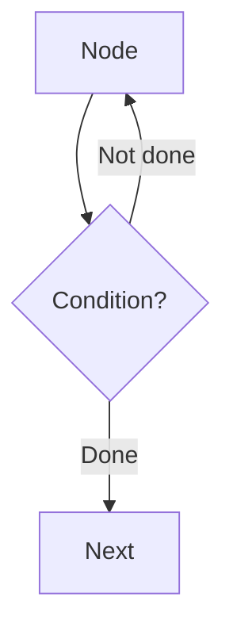
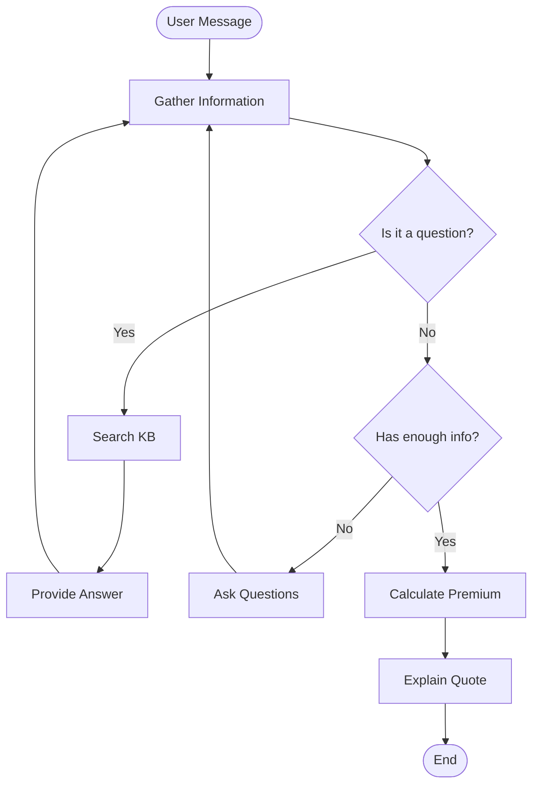

# 🔄 Iterative Workflow: Visual Design → Code → Test → Modify
**Complete Cycle for Workshop Part 3**

---

## 🎯 The Complete Workflow

```
┌─────────────────────────────────────────────────────────────┐
│  ITERATION 1: Initial Design                                │
└─────────────────────────────────────────────────────────────┘
    ↓
1. Orchestrators: Design visual workflow (Mermaid)
    ↓
2. Implementers: Code it (LangGraph)
    ↓
3. Together: Test with scenarios
    ↓
4. Find issues? → ITERATE!
    ↓
┌─────────────────────────────────────────────────────────────┐
│  ITERATION 2: Refinement                                    │
└─────────────────────────────────────────────────────────────┘
    ↓
5. Orchestrators: Update visual design
    ↓
6. Implementers: Modify code
    ↓
7. Together: Test again
    ↓
8. Works? → DONE! ✅
```

---

## 📊 Example: Complete Iteration Cycle

### **ITERATION 1: Initial Design**

#### **Step 1: Orchestrators Design Visually** (5 min)

**In Mermaid Live Editor**:



**Orchestrators say**: "Simple flow - gather info, then calculate"

---

#### **Step 2: Implementers Code It** (5 min)

```python
# langgraph_agent.py - Version 1

from langgraph.graph import StateGraph, END

workflow = StateGraph(AgentState)

# Add nodes (from visual design)
workflow.add_node("gather", gather_info_node)
workflow.add_node("calculate", calculate_quote_node)

# Add edges (from visual design)
workflow.set_entry_point("gather")
workflow.add_edge("gather", "calculate")
workflow.add_edge("calculate", END)

agent = workflow.compile()
```

**Implementers say**: "Coded exactly as designed!"

---

#### **Step 3: Test Together** (3 min)

**Test Case 1**: "I need car insurance"

```
Expected: Ask for info, then calculate
Actual: Immediately tries to calculate ❌
Problem: No decision logic - always calculates even without info!
```

**Orchestrators**: "Wait, it should ask questions first!"  
**Implementers**: "The visual design didn't show that decision"

---

### **ITERATION 2: Add Decision Logic**

#### **Step 4: Orchestrators Update Visual** (3 min)

**Updated Mermaid design**:



**Orchestrators say**: "Added decision - check if we have enough info!"

---

#### **Step 5: Implementers Modify Code** (5 min)

```python
# langgraph_agent.py - Version 2

workflow = StateGraph(AgentState)

# Same nodes
workflow.add_node("gather", gather_info_node)
workflow.add_node("calculate", calculate_quote_node)

# NEW: Add decision function
def has_enough_info(state):
    """Check if we have required information"""
    user_info = state.get("user_info", {})
    
    required = ["age", "vehicle_year", "years_licensed"]
    
    if all(field in user_info for field in required):
        return "calculate"  # Have everything
    else:
        return "gather"  # Need more info

# NEW: Conditional edge instead of direct edge
workflow.set_entry_point("gather")
workflow.add_conditional_edges(
    "gather",
    has_enough_info,
    {
        "calculate": "calculate",
        "gather": "gather"  # Loop back
    }
)
workflow.add_edge("calculate", END)

agent = workflow.compile()
```

**Implementers say**: "Added the decision logic from your updated design!"

---

#### **Step 6: Test Again** (3 min)

**Test Case 1**: "I need car insurance"

```
Expected: Ask for info
Actual: "What's your age?" ✅
```

**Test Case 2**: "I'm 28, drive a 2020 Honda, licensed 10 years"

```
Expected: Calculate quote
Actual: Shows quote ✅
```

**Orchestrators**: "Perfect! But what about questions like 'What is collision coverage?'"

---

### **ITERATION 3: Add Knowledge Search**

#### **Step 7: Orchestrators Add to Visual** (3 min)



**Orchestrators say**: "Added knowledge search branch!"

---

#### **Step 8: Implementers Add Feature** (7 min)

```python
# langgraph_agent.py - Version 3

from rag_system import search_knowledge

workflow = StateGraph(AgentState)

# Add nodes
workflow.add_node("gather", gather_info_node)
workflow.add_node("search_kb", search_knowledge_node)  # NEW
workflow.add_node("calculate", calculate_quote_node)

# NEW: Check if user is asking a question
def route_message(state):
    """Decide: question or info gathering?"""
    last_message = state["messages"][-1].content.lower()
    
    question_keywords = ["what is", "explain", "tell me about", "difference"]
    
    if any(keyword in last_message for keyword in question_keywords):
        return "search"  # User asking question
    else:
        return "check_info"  # User providing info

# NEW: Search knowledge node
def search_knowledge_node(state):
    """Search knowledge base and answer"""
    query = state["messages"][-1].content
    results = search_knowledge(query, k=2)
    
    context = "\n".join([doc.page_content for doc in results])
    
    # Generate answer using context
    answer = f"Based on our knowledge: {context}"
    state["messages"].append(AIMessage(content=answer))
    
    return state

# Build workflow
workflow.set_entry_point("gather")

workflow.add_conditional_edges(
    "gather",
    route_message,
    {
        "search": "search_kb",      # NEW branch
        "check_info": "gather"
    }
)

workflow.add_edge("search_kb", "gather")  # After answering, back to gathering

workflow.add_conditional_edges(
    "gather",
    has_enough_info,
    {
        "calculate": "calculate",
        "gather": "gather"
    }
)

workflow.add_edge("calculate", END)

agent = workflow.compile()
```

**Implementers say**: "Added knowledge search exactly as you designed!"

---

#### **Step 9: Final Test** (3 min)

**Test Case 3**: "What is collision coverage?"

```
Expected: Search knowledge base and explain
Actual: "Collision coverage pays for damage to YOUR vehicle..." ✅
```

**Test Case 4**: Multi-turn conversation

```
User: "What is collision coverage?"
Agent: [Explains collision] ✅

User: "I'm 28"
Agent: "What vehicle do you drive?" ✅

User: "2020 Honda Civic, licensed 10 years, no accidents"
Agent: [Shows quote] ✅
```

**Everyone**: "It works! 🎉"

---

## 🔧 How to Modify After Initial Build

### **Scenario: Add New Feature**

**Orchestrators want**: "Agent should offer discounts after showing quote"

#### **Step 1: Update Visual Design**



#### **Step 2: Implementers Add Code**

```python
# Add new node
workflow.add_node("offer_discounts", offer_discounts_node)

# Add decision
def check_discount_eligibility(state):
    """Check if user qualifies for discounts"""
    user_info = state["user_info"]
    
    # Check eligibility
    if user_info.get("years_licensed", 0) > 10:
        return "offer"
    elif user_info.get("accidents", 0) == 0:
        return "offer"
    else:
        return "skip"

# Update workflow
workflow.add_conditional_edges(
    "calculate",
    check_discount_eligibility,
    {
        "offer": "offer_discounts",
        "skip": END
    }
)

workflow.add_edge("offer_discounts", END)
```

#### **Step 3: Test**

```
User provides info → Quote calculated → "You qualify for a 15% good driver discount!" ✅
```

---

## 📋 Modification Patterns

### **Pattern 1: Add New Node**

**Visual**:


**Code**:
```python
# Add node
workflow.add_node("new_node", new_node_function)

# Add edges
workflow.add_edge("existing_node", "new_node")
workflow.add_edge("new_node", "next_node")
```

---

### **Pattern 2: Add Decision**

**Visual**:


**Code**:
```python
# Add decision function
def new_decision(state):
    if condition:
        return "path1"
    else:
        return "path2"

# Add conditional edge
workflow.add_conditional_edges(
    "node",
    new_decision,
    {
        "path1": "node_path1",
        "path2": "node_path2"
    }
)
```

---

### **Pattern 3: Add Loop**

**Visual**:


**Code**:
```python
def check_condition(state):
    if state["is_complete"]:
        return "next"
    else:
        return "loop"

workflow.add_conditional_edges(
    "node",
    check_condition,
    {
        "next": "next_node",
        "loop": "node"  # Back to same node
    }
)
```

---

## ✅ Workshop Timeline with Iterations

### **Part 3: Add Intelligence (20 min)**

**0:30-0:35** | Iteration 1: Basic Flow
- Orchestrators: Design simple flow
- Implementers: Code it
- Test: Find it's too simple

**0:35-0:40** | Iteration 2: Add Decisions
- Orchestrators: Add decision logic
- Implementers: Add conditional edges
- Test: Works better!

**0:40-0:45** | Iteration 3: Add Knowledge
- Orchestrators: Add search branch
- Implementers: Integrate RAG
- Test: Handles questions!

**0:45-0:50** | Final Polish
- Test all scenarios
- Fix any issues
- Celebrate! 🎉

---

## 🎯 Key Principles

1. **Start Simple**: Basic flow first, add complexity later
2. **Iterate Quickly**: Design → Code → Test → Repeat
3. **Test Often**: After each change, verify it works
4. **Communicate**: Orchestrators explain intent, implementers ask questions
5. **Visual First**: Always update visual design before coding

---

## 📚 Complete Example Files

### **Visual Design** (Orchestrators maintain)
Save as: `docs/agent_workflow.mmd`



### **Code Implementation** (Implementers maintain)
File: `backend/langgraph_agent.py`

```python
# Complete implementation matching visual design above
# (Full code in repository)
```

---

## ✅ Success Checklist

**After each iteration**:
- [ ] Visual design updated
- [ ] Code matches visual design
- [ ] All test cases pass
- [ ] No regressions (old features still work)
- [ ] Both teams agree it's correct

---

**Remember**: The visual design is the source of truth! Code should always match the diagram. 🎨→💻
