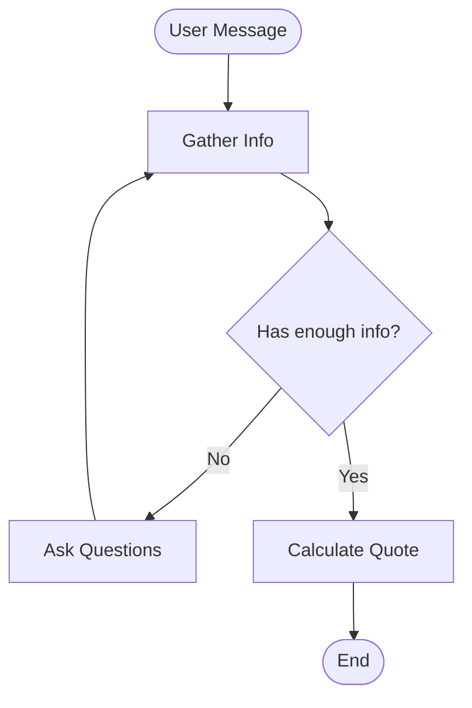
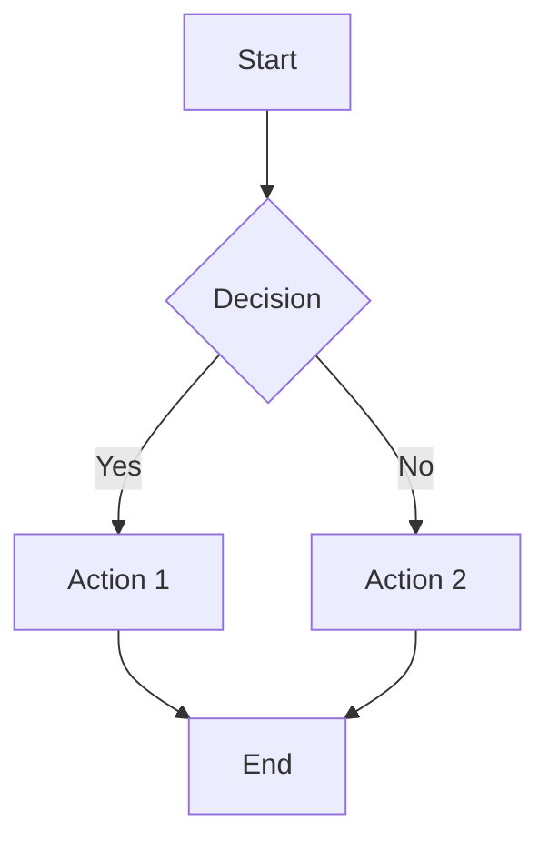

# 🎨 LangChain/LangGraph: Code-First, Not Visual-First
**Understanding the Workflow**

---

## 🎯 The Reality Check

### **What LangChain/LangGraph ARE**:
- ✅ **Code-first frameworks** - You write Python
- ✅ **Can generate diagrams** - After you code
- ✅ **Powerful orchestration** - State management, routing

### **What LangChain/LangGraph are NOT**:
- ❌ **Visual builders** - No drag-and-drop interface
- ❌ **Auto-code generators** - Can't draw → get code
- ❌ **No-code tools** - Requires programming

---

## 📊 How Visualization Works

### **Standard LangGraph Workflow**:

```
Step 1: Write Code
┌─────────────────────────────────────┐
│ workflow = StateGraph(AgentState)   │
│ workflow.add_node("gather", ...)    │
│ workflow.add_node("calculate", ...) │
│ workflow.add_edge("gather", "calc") │
└─────────────────────────────────────┘
              ↓
Step 2: Run Code
┌─────────────────────────────────────┐
│ agent = workflow.compile()          │
│ result = agent.invoke(input)        │
└─────────────────────────────────────┘
              ↓
Step 3: Generate Diagram (Optional)
┌─────────────────────────────────────┐
│ from langgraph.graph import draw    │
│ draw(workflow)                      │
│ # Saves: agent_graph.png            │
└─────────────────────────────────────┘
              ↓
Step 4: See Visualization
┌─────────────────────────────────────┐
│        [Gather]                     │
│           ↓                         │
│      [Calculate]                    │
└─────────────────────────────────────┘
```

**Key Point**: Visualization happens **AFTER** coding, not before!

---

## 🔧 Available Visualization Tools

### **1. LangGraph Built-in (Free)**

**Generate static diagram**:
```python
from langgraph.graph import StateGraph

workflow = StateGraph(AgentState)
# ... add nodes and edges ...

# Generate Mermaid diagram
mermaid_diagram = workflow.get_graph().draw_mermaid()
print(mermaid_diagram)

# Or save as PNG
from langgraph.graph import draw
draw(workflow, output_path="agent_graph.png")
```

**Output**: Static image showing your graph

**Pros**:
- ✅ Free
- ✅ Built-in
- ✅ Good for documentation

**Cons**:
- ❌ Static only (no interaction)
- ❌ Generated after coding
- ❌ Can't edit visually

---

### **2. LangGraph Studio (Paid - $30/month)**

**Visual debugging environment**:
- ✅ See graph while it runs
- ✅ Step through nodes
- ✅ Inspect state at each step
- ✅ Interactive testing

**How it works**:
```
1. Write LangGraph code
2. Open in LangGraph Studio
3. Run agent
4. Watch it execute visually
5. Debug issues
```

**Pros**:
- ✅ Real-time visualization
- ✅ Interactive debugging
- ✅ State inspection
- ✅ Great for development

**Cons**:
- ❌ Costs $30/month
- ❌ Still code-first (can't draw to create)
- ❌ Requires local setup

**Website**: https://www.langchain.com/langgraph-studio

---

### **3. Mermaid Live Editor (Free) - OUR APPROACH**

**Visual-first design tool**:
- ✅ Draw diagrams BEFORE coding
- ✅ Free and web-based
- ✅ No installation needed
- ✅ Export as PNG/SVG

**How it works**:
```
1. Design workflow in Mermaid (visual)
2. Share diagram with implementers
3. Implementers code to match design
4. Verify code matches diagram
```

**Pros**:
- ✅ 100% free
- ✅ Visual-first (design before code)
- ✅ Easy for non-coders
- ✅ Great for collaboration

**Cons**:
- ❌ Doesn't generate code
- ❌ Separate from LangGraph
- ❌ Manual translation to code

**Website**: https://mermaid.live/

---

## 🎓 Workshop Approach: Visual-First Design

### **Why We Use Mermaid First**

**Traditional Approach (Code-First)**:
```
Implementer: *writes 100 lines of LangGraph code*
Orchestrator: "What does this do?"
Implementer: "Let me generate a diagram..."
Orchestrator: "Oh, that's not what I wanted!"
Implementer: *rewrites code*
```

**Our Approach (Visual-First)**:
```
Orchestrator: *designs in Mermaid* "Here's what I want"
Implementer: *looks at diagram* "Got it!" *codes*
Orchestrator: "Perfect! That's exactly right!"
```

---

## 🔄 Complete Workshop Workflow

### **Part 3: Add Intelligence (20 min)**

#### **Phase 1: Visual Design (Orchestrators - 7 min)**

**Tool**: Mermaid Live Editor (https://mermaid.live/)

**Activity**:


**Deliverable**: PNG/SVG diagram

---

#### **Phase 2: Code Implementation (Implementers - 10 min)**

**Tool**: Python + LangGraph

**Activity**:
```python
# Translate visual design to code
from langgraph.graph import StateGraph, END

workflow = StateGraph(AgentState)

# Nodes (from diagram)
workflow.add_node("gather", gather_info_node)
workflow.add_node("calculate", calculate_quote_node)

# Decision logic (from diagram)
def has_enough_info(state):
    if state["user_info"]["age"] and state["user_info"]["vehicle"]:
        return "calculate"
    else:
        return "gather"

# Edges (from diagram)
workflow.set_entry_point("gather")
workflow.add_conditional_edges(
    "gather",
    has_enough_info,
    {
        "calculate": "calculate",
        "gather": "gather"  # Loop back
    }
)
workflow.add_edge("calculate", END)

agent = workflow.compile()
```

**Deliverable**: Working LangGraph code

---

#### **Phase 3: Verification (Together - 3 min)**

**Compare visual design to code behavior**:

**Test 1**: "I need car insurance"
- **Visual design says**: Ask for info → Loop back
- **Code does**: Asks for age ✅

**Test 2**: "I'm 28, drive a 2020 Honda, licensed 10 years"
- **Visual design says**: Has info → Calculate
- **Code does**: Shows quote ✅

**Test 3**: Generate diagram from code
```python
# Generate diagram from code
mermaid_diagram = workflow.get_graph().draw_mermaid()
print(mermaid_diagram)
```

**Compare**: Does generated diagram match original design? ✅

---

## 📊 Visualization Comparison

### **Mermaid (Design Phase)**



**Purpose**: Design and communication  
**When**: Before coding  
**Who**: Orchestrators create, everyone reads  
**Output**: PNG/SVG for documentation

---

### **LangGraph Generated (After Coding)**

```python
from langgraph.graph import draw

workflow = StateGraph(AgentState)
# ... add nodes and edges ...

# Generate diagram
draw(workflow, output_path="agent_graph.png")
```

**Purpose**: Verification and documentation  
**When**: After coding  
**Who**: Implementers generate, everyone verifies  
**Output**: PNG showing actual code structure

---

### **LangGraph Studio (Development)**

```
┌─────────────────────────────────────┐
│  LangGraph Studio                   │
│  ┌───────────────────────────────┐  │
│  │  [Gather Info] ← Currently    │  │
│  │       ↓                       │  │
│  │  {Has Info?}                  │  │
│  │       ↓                       │  │
│  │  [Calculate]                  │  │
│  └───────────────────────────────┘  │
│                                     │
│  State:                             │
│  {                                  │
│    "user_info": {"age": 28},       │
│    "messages": [...]               │
│  }                                  │
└─────────────────────────────────────┘
```

**Purpose**: Interactive debugging  
**When**: During development  
**Who**: Implementers use  
**Output**: Real-time execution view

---

## ✅ Best Practices

### **For Orchestrators**:

1. **Design in Mermaid first**
   - Use https://mermaid.live/
   - Keep it simple initially
   - Add complexity iteratively

2. **Export and share**
   - Save as PNG
   - Include in documentation
   - Share with implementers

3. **Verify implementation**
   - Test the coded agent
   - Compare behavior to design
   - Request changes if needed

---

### **For Implementers**:

1. **Start with the visual design**
   - Understand orchestrator's intent
   - Ask questions if unclear
   - Plan code structure

2. **Code to match design**
   - Each node in diagram = `add_node()`
   - Each arrow = `add_edge()`
   - Each diamond = `add_conditional_edges()`

3. **Generate verification diagram**
   ```python
   # After coding
   mermaid = workflow.get_graph().draw_mermaid()
   print(mermaid)
   ```

4. **Compare diagrams**
   - Original (Mermaid) vs Generated (LangGraph)
   - Should match!

---

## 🎯 Key Takeaways

1. **LangGraph is code-first** - You must write Python
2. **Visualization comes after** - Generated from code
3. **Mermaid is design-first** - Draw before coding
4. **Workshop uses both**:
   - Mermaid for design (orchestrators)
   - LangGraph for implementation (implementers)
   - Generated diagrams for verification (both)

5. **LangGraph Studio is optional** - Great for debugging, but costs $30/month

6. **Visual-first approach works** - Design → Code → Verify

---

## 📚 Resources

**Free Tools**:
- Mermaid Live: https://mermaid.live/
- Mermaid Docs: https://mermaid.js.org/
- LangGraph Docs: https://python.langchain.com/docs/langgraph

**Paid Tools**:
- LangGraph Studio: https://www.langchain.com/langgraph-studio ($30/month)

**Workshop Materials**:
- Visual Workflow Activity: `docs/VISUAL_WORKFLOW_ACTIVITY.md`
- Iterative Workflow Guide: `docs/ITERATIVE_WORKFLOW_GUIDE.md`
- Visual LangGraph Guide: `docs/VISUAL_LANGGRAPH_GUIDE.md`

---

## 🔧 Code Example: Generate Diagram

```python
# After building your LangGraph workflow
from langgraph.graph import StateGraph

workflow = StateGraph(AgentState)
workflow.add_node("gather", gather_node)
workflow.add_node("calculate", calculate_node)
workflow.add_edge("gather", "calculate")
workflow.add_edge("calculate", END)

# Method 1: Get Mermaid code
mermaid_code = workflow.get_graph().draw_mermaid()
print(mermaid_code)
# Output:
# graph TD
#     gather --> calculate
#     calculate --> __end__

# Method 2: Save as PNG (requires graphviz)
from langgraph.graph import draw
draw(workflow, output_path="my_agent.png")

# Method 3: Display in Jupyter
from IPython.display import Image, display
display(Image(workflow.get_graph().draw_mermaid_png()))
```

---

## ✅ Summary

**Question**: "Is LangGraph visual-oriented?"

**Answer**: **No, it's code-first**. But:
- ✅ Can generate diagrams after coding
- ✅ LangGraph Studio provides visual debugging
- ✅ Our workshop uses Mermaid for visual-first design
- ✅ Best of both worlds: Design visually, implement in code

**Workshop Flow**:
```
Mermaid (Design) → LangGraph (Code) → Generated Diagram (Verify)
     ↑                                        ↓
     └────────── Iterate if mismatch ─────────┘
```

---

**Remember**: The visual design (Mermaid) is your source of truth. The code should match it! 🎨→💻
