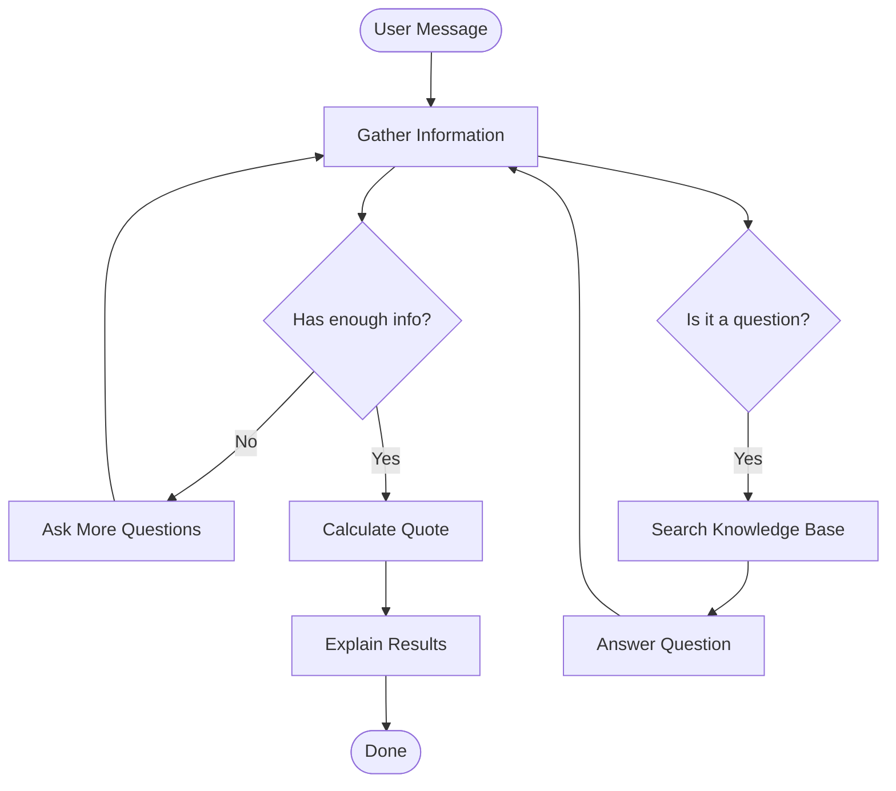
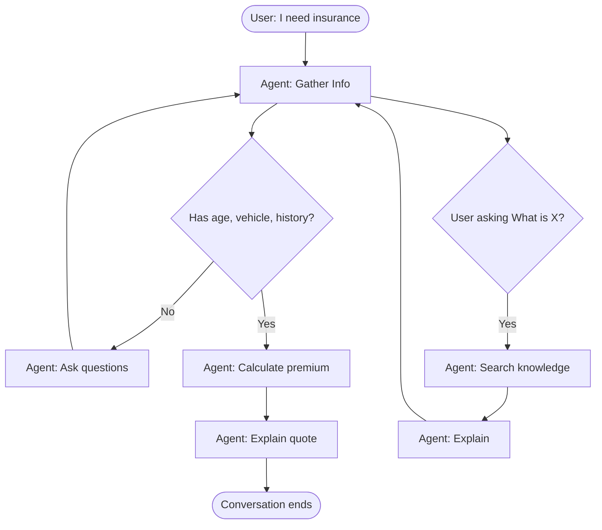
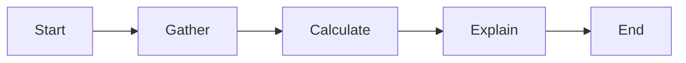
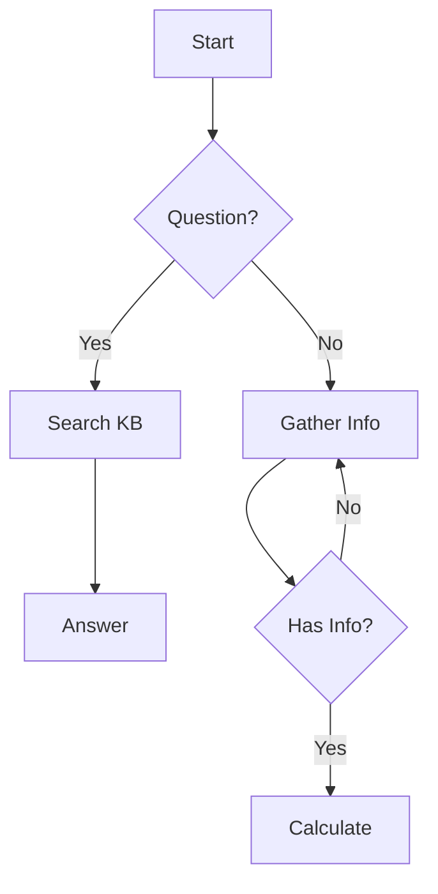
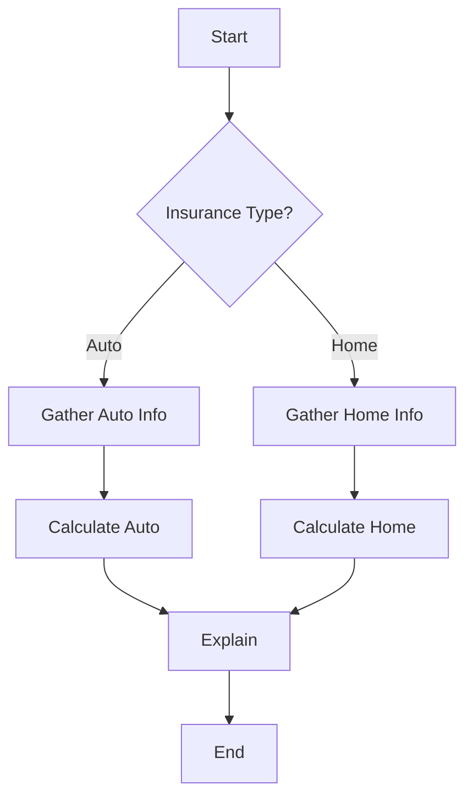
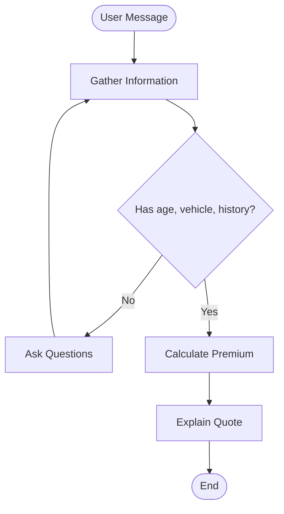

# 🎨 Visual LangGraph Design Guide for Orchestrators
**Build Agent Workflows Without Code**

---

## 🎯 Overview

**Good news**: You can design the entire agent workflow visually! Here are 3 ways:

1. **LangGraph Studio** (Official visual tool - BEST)
2. **Mermaid Diagrams** (Draw flowcharts)
3. **Whiteboard/Paper** (Sketch and hand off to implementers)

---

## 🚀 Method 1: LangGraph Studio (Recommended)

### What is LangGraph Studio?

**LangGraph Studio** is a visual IDE for building and debugging agents. It's like a flowchart editor specifically for AI agents.

**Download**: https://github.com/langchain-ai/langgraph-studio

### Features for Orchestrators

✅ **Visual graph builder** - Drag and drop nodes
✅ **Live testing** - See agent think in real-time
✅ **Step-by-step debugging** - Watch each decision
✅ **No code required** - Export to code when ready

### How to Use It

**Step 1: Install LangGraph Studio**
```bash
# Implementers help with this
npm install -g @langchain/langgraph-studio
langgraph-studio
```

**Step 2: Create Your Agent Visually**

1. **Add Nodes** (the actions):
   - Click "Add Node"
   - Name it: "gather_info", "calculate_quote", etc.
   - Describe what it does

2. **Connect Nodes** (the flow):
   - Drag from one node to another
   - Add conditions: "if has_enough_info → calculate"

3. **Test It**:
   - Click "Run"
   - Type: "I need car insurance"
   - Watch the agent flow through nodes!

**Step 3: Export to Code**
- Click "Export"
- Give to implementers
- They add it to `langgraph_agent.py`

### Visual Example in Studio

```
┌─────────────────────────────────────────────┐
│  LangGraph Studio                           │
├─────────────────────────────────────────────┤
│                                             │
│   [START]                                   │
│      ↓                                      │
│   ┌──────────────┐                          │
│   │ gather_info  │  ← You design this       │
│   └──────────────┘                          │
│      ↓                                      │
│   {Decision}  ← You add conditions          │
│    /    \                                   │
│   /      \                                  │
│  ↓        ↓                                 │
│ [search]  [calculate]  ← You connect these  │
│  ↓        ↓                                 │
│ [respond] [explain]                         │
│  ↓        ↓                                 │
│   [END]  [END]                              │
│                                             │
└─────────────────────────────────────────────┘
```

---

## 🎨 Method 2: Mermaid Diagrams (In Browser)

### What is Mermaid?

**Mermaid** lets you draw flowcharts using simple text. Perfect for orchestrators!

**Try it**: https://mermaid.live/

### How to Design Your Agent

**Step 1: Open Mermaid Live Editor**
- Go to https://mermaid.live/
- You'll see a code editor and a preview

**Step 2: Design Your Workflow**

**Copy this template**:


**Step 3: Customize It**

Change the text to match your agent:
- **Nodes** (rectangles): Actions the agent takes
- **Diamonds**: Decisions the agent makes
- **Arrows**: Flow from one step to another

**Step 4: Export**
- Click "Download PNG"
- Share with implementers
- They code it!

### Visual Example

Here's what your design looks like:



**What this shows**:
1. Agent gathers info
2. If missing details → asks questions (loops back)
3. If has details → calculates quote
4. If user asks "what is X?" → searches knowledge base

---

## 📝 Method 3: Whiteboard Design (Workshop Activity)

### For the Workshop

**Activity**: "Design Your Agent Workflow" (15 min)

**Materials**:
- Whiteboard or large paper
- Sticky notes (different colors)
- Markers

**Steps**:

**1. Define Nodes (Yellow sticky notes)**
```
┌─────────────────┐
│  Gather Info    │  ← What the agent does
└─────────────────┘

┌─────────────────┐
│  Search KB      │
└─────────────────┘

┌─────────────────┐
│  Calculate      │
└─────────────────┘
```

**2. Add Decisions (Pink sticky notes)**
```
      ┌─────────────────┐
      │ Has enough info?│  ← Agent decides
      └─────────────────┘
           /    \
          /      \
        Yes      No
```

**3. Draw Arrows (Marker)**
```
[Gather] ──→ {Decision} ──→ [Calculate]
               │
               ↓
            [Ask More]
```

**4. Test It**
- Walk through a scenario
- "User says: I need insurance"
- Follow the arrows
- Does it make sense?

**5. Take a Photo**
- Snap a picture of the whiteboard
- Share with implementers
- They code it!

---

## 🔄 Visual to Code Translation

### How Implementers Convert Your Design

**Your Visual Design**:
```
[Gather Info] → {Has info?} → [Calculate]
                     ↓
                  [Ask More] → [Gather Info]
```

**Becomes Code**:
```python
# Your nodes
workflow.add_node("gather_info", gather_info_node)
workflow.add_node("calculate", calculate_node)

# Your decision
def has_enough_info(state):
    if state["user_info"]["age"] and state["user_info"]["vehicle"]:
        return "calculate"
    else:
        return "ask_more"

# Your connections
workflow.add_conditional_edges(
    "gather_info",
    has_enough_info,
    {
        "calculate": "calculate",
        "ask_more": "gather_info"  # Loop back
    }
)
```

**You designed it, they coded it!**

---

## 🎯 Workshop Integration

### Part 3: Visual Design Session (20 min)

**For Orchestrators**:

**Option A: Use Mermaid Live** (if online)
1. Open https://mermaid.live/
2. Copy the template
3. Design your workflow
4. Download PNG
5. Share with implementers

**Option B: Use Whiteboard** (if in-person)
1. Get sticky notes and markers
2. Create nodes for each action
3. Draw decision diamonds
4. Connect with arrows
5. Take photo and share

**Option C: Use LangGraph Studio** (if installed)
1. Open LangGraph Studio
2. Drag and drop nodes
3. Connect them
4. Test with sample input
5. Export to code

**For Implementers**:
- Receive the visual design
- Translate to `langgraph_agent.py`
- Show orchestrators the code
- Run it together!

---

## 📊 Visual Design Templates

### Template 1: Simple Linear Flow

**Use for**: Simple quote calculator

---

### Template 2: Decision Tree

**Use for**: Agent with knowledge base

---

### Template 3: Multi-Path Flow

**Use for**: Multiple insurance types

---

## 🎨 Design Principles for Orchestrators

### 1. Keep It Simple
- Start with 3-5 nodes
- Add complexity later
- Each node = one clear action

### 2. Think Like a User
- What would you ask?
- What info do you need?
- When should agent calculate?

### 3. Add Loops
- Agent asks → User answers → Agent asks more
- This is the "conversation" part!

### 4. Include Decisions
- "If user asks question → search knowledge"
- "If has enough info → calculate"
- "If missing details → ask more"

### 5. Test Your Design
- Walk through scenarios
- Does it handle edge cases?
- Can it recover from errors?

---

## 🔧 Tools Summary

| Tool | Best For | Skill Level | Output |
|------|----------|-------------|--------|
| **LangGraph Studio** | Full workflow design | Beginner | Working code |
| **Mermaid Live** | Quick diagrams | Beginner | PNG image |
| **Whiteboard** | Collaborative design | None | Photo |
| **Draw.io** | Detailed flowcharts | Beginner | PNG/SVG |
| **Excalidraw** | Hand-drawn style | Beginner | PNG |

---

## 📚 Resources for Orchestrators

**Learn Mermaid**:
- Tutorial: https://mermaid.js.org/intro/
- Live editor: https://mermaid.live/
- Examples: https://mermaid.js.org/syntax/flowchart.html

**LangGraph Studio**:
- Download: https://github.com/langchain-ai/langgraph-studio
- Docs: https://langchain-ai.github.io/langgraph/

**Flowchart Tools**:
- Draw.io: https://app.diagrams.net/
- Excalidraw: https://excalidraw.com/
- Lucidchart: https://www.lucidchart.com/

---

## 🎯 Workshop Activity: Design Your Agent

**Time**: 20 minutes

**Goal**: Create a visual workflow for the insurance agent

**Steps**:

1. **Choose your tool** (5 min)
   - Mermaid Live (online)
   - Whiteboard (in-person)
   - LangGraph Studio (advanced)

2. **Design the flow** (10 min)
   - Add nodes: gather, search, calculate
   - Add decisions: has info? is question?
   - Connect with arrows

3. **Test it** (3 min)
   - Walk through: "I need car insurance"
   - Does it make sense?
   - Fix any issues

4. **Share with implementers** (2 min)
   - Show your design
   - Explain the logic
   - They code it!

---

## ✅ Success Criteria

**Your visual design should**:
- ✅ Show all major actions (nodes)
- ✅ Include decision points (diamonds)
- ✅ Have clear flow (arrows)
- ✅ Handle loops (ask more questions)
- ✅ Be understandable by implementers

**Implementers should be able to**:
- ✅ Look at your design
- ✅ Understand the logic
- ✅ Code it in 10 minutes
- ✅ Run it successfully

---

## 🎉 You're a Visual Designer!

**Remember**:
- Visual design is just as important as code
- Your flowcharts guide the implementation
- Good design = better agent
- Collaborate with implementers
- Iterate and improve!

---

**Questions? Ask the facilitator or check the resources above!**

---

## Appendix: Sample Workshop Workflow

**What Orchestrators Design**:


**What Implementers Code**:
```python
workflow = StateGraph(AgentState)
workflow.add_node("gather", gather_node)
workflow.add_node("calculate", calculate_node)
workflow.add_node("explain", explain_node)

workflow.add_conditional_edges(
    "gather",
    lambda s: "calculate" if has_info(s) else "gather",
    {"calculate": "calculate", "gather": "gather"}
)

workflow.add_edge("calculate", "explain")
workflow.add_edge("explain", END)
```

**What Everyone Tests**:
- Input: "I'm 28, drive a 2020 Honda"
- Expected: Agent asks for driving history
- Then: Calculates quote
- Then: Explains breakdown

---

**END OF VISUAL DESIGN GUIDE**
